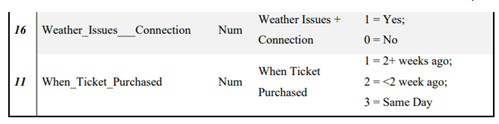

# AirLincoln Data Analysis Project

Welcome to the AirLincoln Data Analysis Project! This project is part of the final assessment for the Data Mining II course at INTEC. In this project, we assume the role of data analysts tasked with optimizing the business model of the fictional airline AirLincoln by analyzing their data to increase profitability.

## 📋 Project Overview

The main goal of this project is to predict the percentage of passengers who do not show up for their flights, which is crucial for implementing an overbooking strategy. Overbooking can significantly increase profits by selling more tickets than seats available, though it carries the risk of not having enough seats if all passengers show up.

## 📁 Table of Contents

1. [Introduction](#introduction)
2. [Data Profiling](#data-profiling)
3. [Metadata Analysis](#metadata-analysis)
4. [Automated Tools Analysis](#automated-tools-analysis)
5. [Modeling](#modeling)
6. [Model Comparison and Selection](#model-comparison-and-selection)
7. [Conclusion](#conclusion)

## 🌟 Introduction

For this project, we analyzed AirLincoln's data using SAS Visual Analytics to identify key factors that affect the no-show rates of passengers. This information is critical to optimize the airline's overbooking strategy, aiming to maximize profits while minimizing risks.

## 🔍 Data Profiling

The dataset, `AirLincolnData2`, contains approximately 10,000 records and 16 variables. Initial data profiling revealed anomalies, such as duplicate `Customer_ID` values and suspicious age data with a mean of 4 and a maximum of 8. Further inspection showed that many variables have categorical rather than numerical properties, prompting a re-categorization for accurate analysis.

## 🧬 Metadata Analysis

Through metadata review, we reclassified several variables as categorical, except for `Customer_ID`, to better understand their distributions and impacts on the no-show rates. We also created a new variable, `Age_Groups_LTD`, with 4 levels to simplify the age variable.

## 🤖 Automated Tools Analysis

Using SAS Visual Analytics' Automated Explanation and Automated Prediction tools, we identified key correlations and factors influencing no-shows, such as weather issues and booking connections. Predictions suggest that weather problems significantly increase no-show rates, especially when tickets are purchased well in advance.

## 📊 Modeling

We developed several models to predict no-show probabilities:
- **Logistic Regression Model**: Focused on significant variables with a classification error rate of 0.0615.
- **Decision Tree Model**: Highlighted the impact of weather conditions and connection status on no-shows.
- **Random Forest Model**: Improved accuracy over decision trees but lost interpretability.
- **Gradient Boosting Model**: Provided robust predictions with minimized overfitting.
- **Neural Network Model**: Explored complex patterns at the cost of interpretability.

## 🥇 Model Comparison and Selection

After evaluating the models with a prediction cutoff of 0.1, considering that approximately 10% of passengers do not show up, the Random Forest Model was selected as the best-performing model due to its lowest classification error rate.

## 📈 Conclusion

Through detailed analysis and modeling, we have developed a predictive framework that AirLincoln can use to optimize its overbooking strategy. The Random Forest Model, when iteratively refined, will enable the airline to predict no-show passengers accurately, maximizing seat sales while managing potential risks.

## 🛠️ Project Development and Visuals

More details:

- ## **Data Exploration**: 
**The tool used throughout this project is SAS Visual Analytics, and the dataset utilized is AirLincolnData2.**

The dataset contains approximately 10,000 records and 16 numerical variables. Let's analyze the variables and identify any anomalies within the table.

We observed that the primary key, Customer_ID, contains some duplicate entries. Additionally, we detected anomalies, such as the average age being '4' and the maximum age being '8'. Moreover, the other variables have only two possible values in the table, with a maximum of eight, indicating that we might be dealing with categorical values rather than numerical ones as initially presented. Let's analyze the distribution of some of these variables.

Indeed, we can see anomalies in these tables, particularly regarding the meaning of the variable values. For example, what does a value of 1 or 0 signify in the context of No-Show frequency or when Gender is Female? To clarify whether these variables are truly numerical or categorical, let's review the table's metadata.

In the metadata, we can see the meaning of the variable values. Let’s proceed by converting these variables into categorical ones. For instance, it doesn't make sense to say that booking_Class where 2 = Business is twice the value of 1 = First, or that 3 = Coach is Business minus First.

- ## **Feature Engineering**: 
    
Next, we will convert the discussed variables to categorical for better handling. Specifically, all variables will be changed to categorical, except for Customer_ID. We will then proceed to re-plot the data.**

Now, we can draw more accurate conclusions from the variables we previously plotted. Let's also consider modifying the levels of the age variable, as eight levels might be excessive and may not yield optimal results. Therefore, let's create a new variable, Age_Groups_LTD, with only four levels.

In the next section, let's explore the results we can leverage from the Visual Analytics tools, specifically Automated Explanation and Automated Prediction.

### Automated Explanation

The tool provides a summary of some correlations and the impact that variables may have on our variable of interest: No-Show. We can see that 10% of passengers who purchased tickets did not show up. The factors that most influenced absences are Weather Issues, followed by Connections to a lesser extent.

However, on the right panel, we still observe that some passengers do not show up even when there are no weather issues. When there are weather issues, 35% of passengers do not show up, compared to 6% when there are no weather problems.

Additionally, we observe group formations, such as passengers who purchased tickets more than two weeks in advance and face weather issues, where 91.5% do not show up.

### Automated Prediction

In this section, we selected the variables: Weather Issues, Booking Class, Connections, and Business Traveler. The Automated Prediction tool will provide the most likely prediction for the values of the factors we've considered.

In this case, the tool identifies the best model as a decision tree. According to this model, if the data show Weather Issues = 1, Booking Class = 2, Connections = 1, and Business Traveler = 1, it is most likely that a passenger with these characteristics will not show up.

These tools offer a brief glimpse into the conclusions and predictions we can derive from our data to answer whether a passenger will be absent (No-Show). This will streamline our analysis as we move on to the next section, where we will create and compare our models.

- ## **Model Training and Evaluation**: 
The Automated Prediction tool gave us an initial idea of what we can create. In this section, we will similarly develop multiple models and evaluate them to select the best-performing model, verifying the results of Automated Prediction.

We will also create a partition to split our dataset into 80% for training and 20% for validation. This approach helps prevent our models from overfitting to the training data and ensures that the model encounters new data within the 20% validation set, allowing us to assess its accuracy. This step is crucial because a model may achieve high accuracy during training but perform poorly when presented with new data, leading to significant errors.

### Logistic Regression Model

We began with the logistic regression model to predict when a passenger is likely not to show up. This model considers most of the significant variables, with only two combinations excluded: Weather Issues + Connections and Connections + International Flights.

The adjustment summary highlights the significance of various variables with their corresponding p-values, showing that variables like 'Weather Issues,' 'When Ticket Purchased,' and 'Connections' are statistically significant in predicting no-shows, as indicated by the very low p-values (most less than 0.001). These variables play a critical role in shaping the model’s predictive capabilities, underscoring their importance in understanding passenger behavior.

The residuals plot shows that the majority of residuals are concentrated around 0, indicating a good fit of the model to the data. This concentration suggests that the logistic regression model accurately captures the relationship between the predictors and the outcome variable, which in this case is whether a passenger will show up or not.

The influence plot displays the observations sorted by their impact on the model, with a few observations showing higher influence on the likelihood displacement. This information is crucial for diagnosing any potential issues with specific data points that might unduly affect the model’s performance.

Lastly, the confusion matrix shows the model’s performance across training and validation sets. The logistic regression model achieved a misclassification rate of 0.0615 on the validation set, which we consider an ideal statistic for evaluating the models (generally, the lower, the better). The high number of correct predictions (5,319 true positives in training and 3,536 in validation) compared to the relatively low misclassification counts reaffirms the model’s robustness.

Overall, the logistic regression model provides a clear, interpretable framework for predicting passenger no-shows, balancing model accuracy with statistical significance of key predictors.

### Decision Tree Model

In this section, we developed a decision tree to predict when a passenger is unlikely to show up. As observed, the majority of passengers do attend their flights, consistent with the data that indicates only about 10% of passengers do not show up.

The variable importance chart highlights that 'Weather Issues' is the most significant factor influencing no-shows, far surpassing other variables like 'Booking Class,' 'Departure Hour,' and 'When Ticket Purchased.' This suggests that weather conditions are a dominant predictor in determining whether passengers are likely to miss their flights.

The decision tree visualization shows how the model uses these variables to classify passengers. The initial split is based on 'Weather Issues,' clearly marking it as the primary decision point. Passengers affected by adverse weather are more likely to be no-shows, represented by the yellow leaves in the tree. Specific patterns emerge, such as passengers with weather issues, purchasing tickets less than two weeks in advance, or traveling during certain departure hours (between 1 and 3), who are significantly more likely to not show up.

Further splits show nuanced groupings, such as passengers without connections but traveling in first class, or those who bought tickets well in advance but are not in first class. Each of these branches provides insights into the various combinations of factors that contribute to no-show behavior, emphasizing the layered decision-making process the tree model captures.

The confusion matrix reinforces the model’s performance, showing a high number of accurate predictions with fewer errors. Notably, the matrix shows a strong distinction between passengers who do show up versus those who do not, confirming the model's ability to differentiate based on the factors identified.

Overall, this decision tree offers a clear, interpretable structure that helps us understand the main drivers behind passenger no-shows

### Random Forest Model

This model is a more developed and precise version compared to the decision tree, but it comes with the disadvantage of losing some of the intuition we previously built. One key difference is that the random forest model now identifies 'Weather Issues + Connection' as the most important factor influencing no-shows, as shown in the variable importance chart.

From the variable importance plot, we can see that ‘Weather Issues + Connection’ has the highest impact, followed by ‘When Ticket Purchased’ and ‘Booking Class’. This indicates that the combined effect of weather issues and flight connections plays a crucial role in determining whether a passenger will show up, suggesting that operational disruptions significantly affect passenger behavior.

The error graph shows the misclassification rates across different stages: training, out-of-bag (OOB), and validation. Notably, the validation error stabilizes around 0.075, which is relatively lower than the initial rates, indicating that the model generalizes well to unseen data. This consistency across multiple trees (up to 100 in this case) emphasizes the robustness of the random forest approach.

The confusion matrix at the bottom confirms the model's accuracy by comparing observed versus predicted values for both training and validation sets. It shows a high number of correct predictions (5,376 true positives in the training set and 3,552 in the validation set), with relatively few false negatives and positives, further validating the model’s reliability.

Overall, this random forest model enhances prediction accuracy and provides a deeper understanding of which variables most significantly impact passenger no-show rates. However, this improvement in precision comes at the cost of interpretability, as the ensemble nature of random forests obscures the straightforward, rule-based understanding offered by decision trees.

### Gradient Boosting Model

This model, which uses Gradient Boosting, is also a more complex algorithm compared to the decision tree, and like the random forest model, it sacrifices interpretability for improved performance. Empirically, Gradient Boosting is generally considered superior to both random forest and decision tree models due to its ability to avoid overfitting and its robustness. However, this comes at the cost of increased computational time.

The variable importance chart shows that 'Weather Issues' is once again identified as the most significant factor influencing no-shows, which aligns with intuitive expectations and differs from the random forest model, where 'Weather Issues + Connections' was erroneously deemed most important. This highlights Gradient Boosting’s strength in providing a more accurate feature ranking, better reflecting real-world impacts.

The error iteration graph demonstrates a steady decline in misclassification rates as the number of iterations increases, showcasing the model's ability to improve its predictions through iterative refinement. The yellow line representing the validation set converges nicely with the blue training set line, indicating that the model generalizes well to new, unseen data without overfitting.

The confusion matrix at the bottom provides further confirmation of the model’s reliability, with a high count of correct predictions (5,316 true positives in training and 3,524 in validation) and minimal misclassifications. This balance of accuracy across training and validation sets supports the robustness of Gradient Boosting in handling varied and complex data patterns.

Overall, while Gradient Boosting does require more computational resources, its empirical superiority and robustness make it a strong candidate for predicting passenger no-shows, particularly in environments where accuracy and resilience against overfitting are paramount.

### Neural Network

Finally, we developed a neural network model to achieve the same objective of predicting passenger no-shows. Neural networks are known for their ability to capture complex, non-linear relationships in data, making them a powerful choice for prediction tasks, though at the cost of interpretability.

The neural network diagram illustrates the intricate structure of the model, with multiple layers of interconnected nodes (neurons) processing the input data. The network's architecture allows it to learn from patterns in the data through weighted connections, which adjust during training to minimize error and optimize predictions.

The iteration graph on the right shows the model's learning process, with a steep decrease in loss (objective function) in the initial iterations, indicating rapid learning at the beginning. As training progresses, the loss plateaus, reflecting that the network has reached an optimal point where further adjustments yield diminishing returns.

The confusion matrix below confirms the model's performance across both training and validation sets. The neural network achieves a misclassification rate of 0.0712, which, while slightly higher than some of the other models, is still within an acceptable range for complex models like this. The high count of true positives (5,304 in training and 3,533 in validation) versus relatively low misclassifications demonstrates the network's efficacy in correctly predicting no-show instances.

While neural networks provide robust predictions, their complexity and the 'black box' nature of their decision-making process mean they offer less interpretability compared to models like decision trees or logistic regression. Nonetheless, they remain a valuable tool in predictive modeling, especially when dealing with intricate data patterns that other models might miss.

### Model Comparison and Winning Model

After developing the five models, we proceeded to compare their performance. We used a prediction cutoff of 0.1, considering that approximately 10% of passengers do not show up. The evaluation criterion chosen for this comparison is the event's misclassification rate, which is crucial in determining the most suitable model. This metric represents the proportion of incorrect classifications, encompassing both type 1 (false positive) and type 2 (false negative) errors, making it an intuitive choice for our evaluation.

The comparison chart on the left displays the misclassification rates across all models, with the logistic regression, decision tree, random forest, gradient boosting, and neural network models all being assessed. The blue bar highlights the selected model—random forest—indicating it achieved the lowest misclassification rate among the candidates.

Using other evaluation criteria could lead to a different model being selected as the best, as each metric emphasizes different aspects of model performance, such as precision, recall, or overall accuracy. However, the intuitive nature of the misclassification rate, which directly reflects the errors in predicting the no-show event, provides a straightforward and meaningful assessment.

The confusion matrix on the right further supports the decision, showing detailed prediction results for each model. It illustrates the balance between true positives and negatives versus misclassifications, reinforcing why the random forest model was chosen. With its robust performance in minimizing the error rate, the random forest stands out as the optimal choice for predicting passenger no-shows in this analysis.

## Conclusion

We analyzed the airline's data, transformed it, and derived some valuable insights during the exploratory analysis. When it came to model creation, we opted for the random forest model, as it minimizes the misclassification rate of the no-show event. Therefore, we consider that implementing this model in an iterative process will allow us to accurately predict the number of passengers who will not show up. This will enable us to maximize the profits from seat overbooking while minimizing potential risks.

## 👥 About the Team

- **Leonardo Vannoni Lorenzo** - [GitHub](https://github.com/Emileo12)

---

Feel free to explore the project, review the code, and provide feedback!
